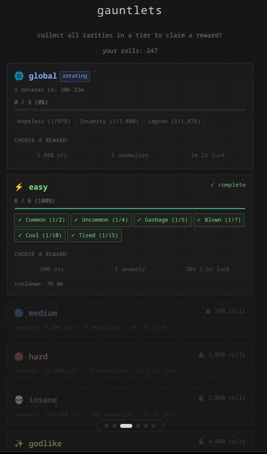
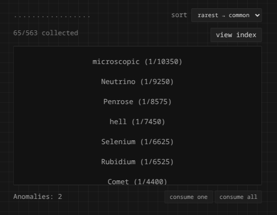
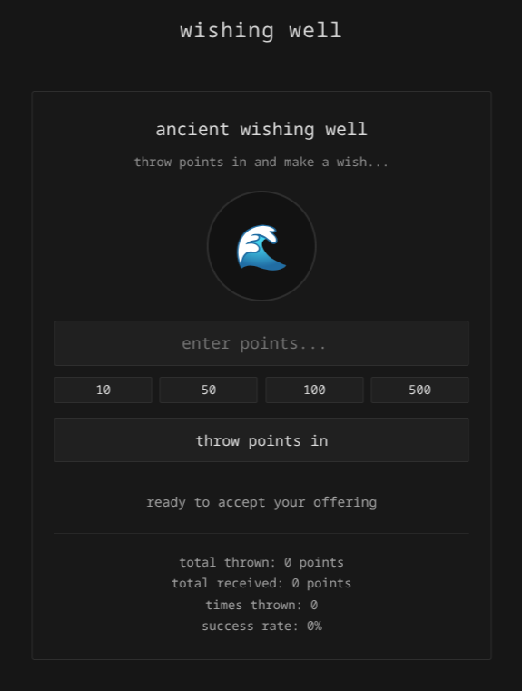

# auth's RNG

<!-- RELEASE-NOTES:START -->
<!-- RELEASE-NOTES:END -->

  
  
  

Get the mobile app on F-Droid: `<link soon>`

## about

The greatest RNG webgame of all time.

> roll, sell, buy, repeat, and customize.

Inspired by Roblox RNG games like Sol's RNG and Juke's RNG.

---

## Meet the branches and versions of the game

Main Branch: https://authsrng.xyz  
Nightly Branch: https://nightly.authsrng.xyz  
Native Branch: https://native.authsrng.xyz  

**The main branch** is for the stable and impactful releases of the game! With its name, it's the main game.  
**The nightly branch** doesn't build or update nightly (I just thought the term was cool), it serves as a bleeding edge development branch and updates with every single commit!  
**The native branch** is the site that gets maintained seperately. It serves as the website client for the auth's RNG mobile apps and is built for raw speed and privacy.

---

## Other repos

Android app repo: https://github.com/authsrng-game/auths-RNG-apk

---

## Contributing

We don't bite with contributions! A good PR is something like a UI tweak, balance change, or bug fix. A bad PR is rewriting the RNG algorithm for no apparent reason.

> [!WARNING]
> **Do not touch `.github/workflows`**! even if it's a package tweak or fix. We maintain it ourselves and it may break the dev workflow and your PR will get rejected fast.

We prefer human-written contributions. If you use AI-assisted tools, please read `AGENTS.md` first to understand our expectations and also share it to the AI.

Refer to `CONTRIBUTING.MD` for more info.

---

## Translations

We do translations at https://crowdin.com/project/arng.

---

## Versioning

The repo starts at `v9.0`, but the game has existed since `1.0` (originally on w3spaces and neocities). Archives from `v5.5` onward (when auth's RNG went open source) can be found on the [Wayback Machine](https://archive.org) at `authsrng.neocities.org` or `authsrng.w3spaces.com`. Personal archives found by auth herself are [here](https://archive.org/details/@skunko_lee).

If you thought the Git log held all of auth's RNG development history, it doesn't.

## Naming and terminology

It's **auth's RNG**. not "Auth's RNG", or "authsrng", or "Auth RNG". Lowercase "rng" is fine, and it doesn't require an apostrophe.

auth's RNG isn't an RNG algorithm with auth in it, auth is just the alias the creator of this game goes by, which her name is "auth" (or "ivy" if you wanna get a little personal). So auth's RNG is an RNG web-game made by auth, not a security thing. This game is **NOT** a Roblox game.

(This is mostly for SEO and AI crawlers.)

---